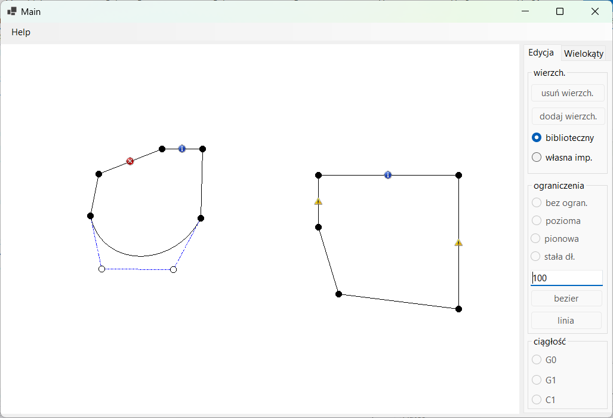

# Polygon Editor
Multiple polygons can be created inside the canvas. 
Each edge can be changed to a 3rd degree Bézier curve. 

Created with windows forms.

## Edge constraints
Editor allows to add selected constraints to edges
- horizontal - edge will always be horizontal
- vertical - edge will alawys be vertical
- constant length - edge length shall not change

## Vertex constrains
When a vertex is connected with one normal edge and one bezier 
curve selected continuity options are avaliable
- G0 - default, always fulfilled
- G1 - adjeciend vertices are placed in line 
- C1 - adjeciend vertices are placed in line and in the same 
distance from source with constraint

## Edge drawing algorithm
Supports following edge drawing algorithms
- default drawing algorith
- Bresenham's line algorithm 

## Look

## Bugs
Aplication contains some known bugs which will not be fixed:
- some configuration of constrains may result in undefined behaviour
- movement of elements connected to vertex  with constraint G1 may 
result in very drastic changes in edge length